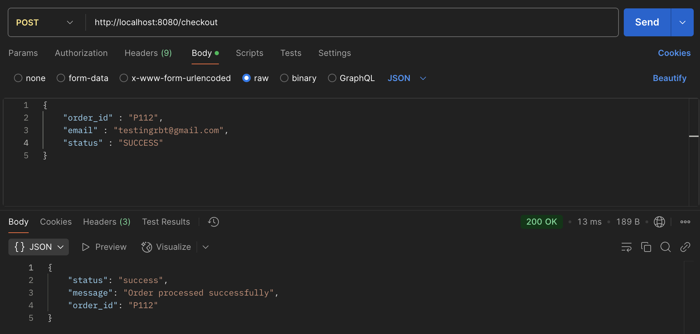
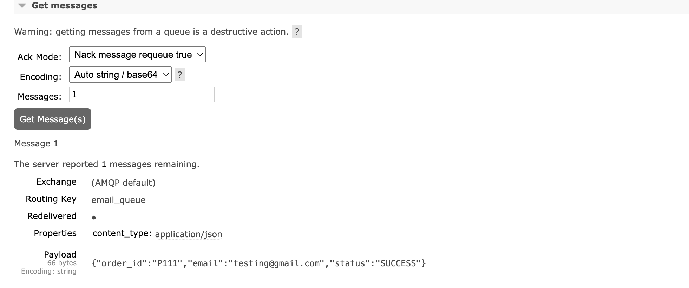
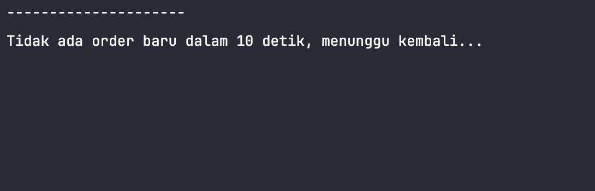

<h1 align='center'>Implementasi RabbitMQ di Golang</h1>

## Teknologi Yang di Gunakan
- Golang
- RabbitMQ

## Checkout Service
Berikut adalah request dan response ketika pengguna melakukan checkout.

Setelah Pengguna melakukan checkout dan berhasil, maka data order akan masuk ke antrian rabbitmq

## Email Service
Best praktis nya sebenarnya email service di pisah menjadi service tersendiri. Tapi karena untuk bahan pengetahuan yaa di satuin deh 😁.

Berikut tampilan log jika proses send email sudah terkirim ke pengguna. 

Dan berikut tampilan log jika di dalam antrian tidak terdapat data yang bisa di ambil oleh email service. 

#### Authors Code
- [@aguskurniawan](https://www.instagram.com/geetoor.mvn/)

Jika ada pertanyaan, mari diskusikan di telegram : `@geetoor`

`bagikan jika ini bermanfaat`
